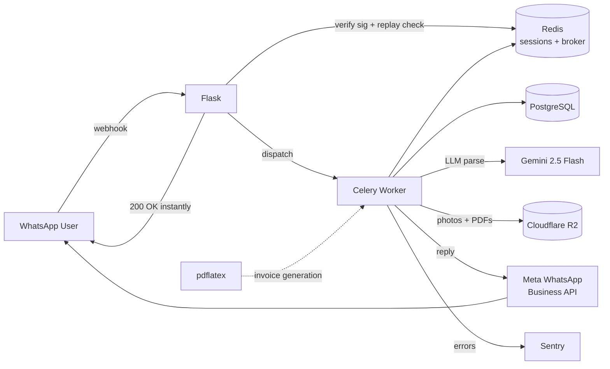

# Organic Farm WhatsApp Bot

Production WhatsApp chatbot for a Malaysian organic farm. Handles the full order lifecycle — from worker crop reporting through buyer ordering, manager pricing, delivery, and refunds — across two business numbers and three languages.

> **Note:** This is a public showcase repository. Source code, business logic, and credentials remain private.

---

## Screenshots

| Worker (BM) | Buyer (EN/CN/BM) | Manager proxy |
|:---:|:---:|:---:|
|  |  |  |

**Sample generated invoice:** [`docs/samples/sample-invoice.pdf`](docs/samples/sample-invoice.pdf)

---

## Architecture



**Routing trick:** dispatches by *receiving* phone number (worker vs buyer WABA), not sender — lets one manager message the buyer number to place proxy orders.

---

## Tech Stack

| Layer | Choice | Why |
|---|---|---|
| Web | Flask + Gunicorn | Lightweight webhook, fast cold start |
| Async | Celery + Redis broker | Webhook returns 200 in <100ms; heavy work offloaded |
| DB | PostgreSQL + connection pool | Relational integrity for invoices/sales/audit |
| Cache/Session | Redis (namespaced keys, TTL) | Session store + replay-protection dedupe |
| Storage | Cloudflare R2 | Zero egress fees for photos & PDFs |
| LLM | Gemini 2.5 Flash | Free-form order parsing ("2kg kangkung, 1kg bayam") |
| PDF | pdflatex (inline LaTeX) | Native Unicode, typographic invoices |
| Errors | Sentry | Release tracking, PII-free |
| Deploy | Railway (Docker) | Managed Postgres + Redis add-ons |
| Testing | pytest + real PG/Redis | 303 tests, ~71% coverage, CI on push/PR |

---

## Features

### Three user roles, dispatched by phone number

- **Workers** (Bahasa Malaysia only) — report crops, log harvests, upload photos
- **Buyers** (EN / CN / BM) — browse crops, place orders with free-form NLU, track deliveries
- **Managers / Owner** — price invoices, mark delivered, issue refunds, proxy-order on behalf of buyers, admin CRUD

### Order lifecycle

```
Buyer order  →  Pricing (manager)  →  Invoice PDF  →  Delivery  →  (optional) Refund → Credit note
```

- **Invoice IDs:** `INV{YYMMDD}{seq}`; credit notes: `CN-{invoice_id}`
- **Free-of-charge quantities** carried from orders into sales on delivery
- **Original invoices are immutable** — refunds generate separate credit notes

### Smart parsing

Buyer types `"2kg kangkung, 1 bayam, half kilo tomato"` → Gemini 2.5 Flash → structured `(name, qty, unit, crop_index)` tuples → matched against current crop list. Falls back to manual flow on failure.

### Manager proxy ordering

Manager messaging the buyer number triggers a setup phase — enter buyer's phone, all DB writes route to that buyer's account. Audited.

---

## Engineering Highlights

### Security

- HMAC signature verification on all inbound webhooks
- Replay protection — short timestamp window + Redis-backed message ID dedupe
- Multi-tier rate limiting (global throughput ceiling + per-sender)
- Signed URLs (HMAC-SHA256) required to retrieve generated invoice PDFs; unsigned → 403
- Request body size capped to mitigate payload abuse
- Phone numbers masked in logs; recipient identifiers stripped from third-party error echoes
- Non-root container user; fail-loud on missing required secrets at boot
- Sentry configured PII-free — sender identifiers hashed before use as user ID

### Architecture patterns

- **Data-driven step pipelines** — crop reporting / harvest logging defined as lists of dicts (`key`, `prompt`, `parse`, `error`); generic handler walks by index. Zero `if/elif` ladders.
- **Dispatch tables** route by session phase — separate tables for ordering, cancellation, proxy, menu
- **Session lifecycle** — load once at entry, save once at exit; reset = rebuild to avoid stale data
- **Append-only audit log** (JSONB) — wired at high-signal sites only (proxy order confirm, refund confirm, admin mutations). Commit-first semantics.
- **Idempotent DB schema init** — safe to re-run

### Testing

- **303 tests**, ~71% coverage, run on every push/PR via GitHub Actions
- **Integration tests hit real Postgres + Redis** (service containers in CI) — no mocks for the data layer
- **Shared fixtures** seed workers, buyers, orders, sales, crops, invoices via factory functions
- **Import-time safety** — env-gated init lets tests import modules without triggering Sentry / DB connections

---

## Project Stats

- ~4.8k lines of Python across 19 modules
- 2 separate WhatsApp Business numbers, routed on the same webhook
- 3 languages, 3 user roles, 1 shared session/audit infrastructure
- Serves a production farm — real invoices, real deliveries, real refunds

---

## Tech I Leveled Up On

- Meta WhatsApp Business Cloud API (webhook signature, media, templates, 24h session window)
- Celery production patterns (dispatcher task vs. worker modules, retries, Sentry integration in worker process)
- LaTeX programmatic generation from Python (template inlining, escape rules, two-pass compile for refs)
- Cloudflare R2 (S3-compatible, egress-free economics)
- PostgreSQL JSONB for audit trails
- Redis namespacing + TTL design for sessions, rate limits, and replay protection

---

## License

MIT — see [LICENSE](LICENSE).

Source code, business logic, customer data, and environment configuration are proprietary and not included in this showcase.
